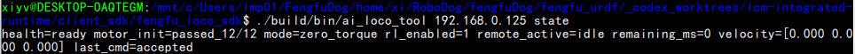
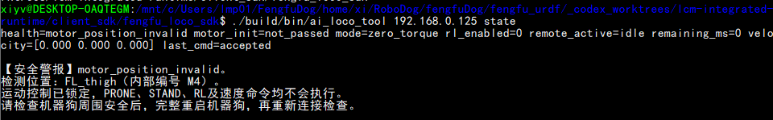
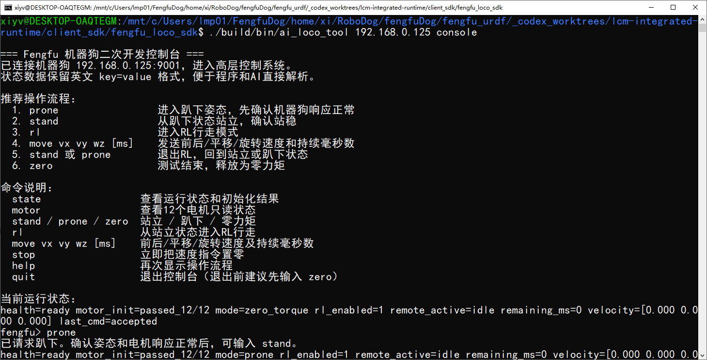

# Fengfu 高层运动 SDK 使用手册

本文档说明 Fengfu 机器狗高层运动 SDK 的连接方式、编译方法、控制流程、接口定义、状态字段、电机信息和故障处理方法。

适用版本：TCP 协议 V1，高层服务端口 `9001`。

正式交付目录为 `client_sdk/fengfu_loco_sdk/`。该目录可以脱离机器狗运行仓库独立复制、编译和使用。

## 目录

1. [SDK 功能范围](#1-sdk-功能范围)
2. [系统结构](#2-系统结构)
3. [网络连接](#3-网络连接)
4. [客户端编译](#4-客户端编译)
5. [控制台使用](#5-控制台使用)
6. [速度命令](#6-速度命令)
7. [C 接口](#7-c-接口)
8. [C++ 接口](#8-c-接口)
9. [高层状态 FF_LocoState](#9-高层状态-ff_locostate)
10. [电机状态 FF_MotorState](#10-电机状态-ff_motorstate)
11. [串口通信诊断](#11-串口通信诊断)
12. [连接和命令可靠性](#12-连接和命令可靠性)
13. [常见问题](#13-常见问题)
14. [二次开发建议](#14-二次开发建议)
15. [安全说明](#15-安全说明)

## 1. SDK 功能范围

高层 SDK 面向二次开发程序、语音控制程序和上层决策程序。客户端发送机体速度和模式请求，机器狗内部继续使用现有 FSM、5432 ONNX 策略、PD 控制、速度限幅、斜坡控制和安全保护。

对外提供三类功能：

1. 高层运动命令：站立、趴下、进入 RL、零力矩、速度控制和停止。
2. 高层运行状态：FSM 模式、初始化状态、当前速度、命令是否接受等。
3. 电机只读状态：12 个电机的角度、速度、扭矩、温度、错误码和串口通信质量。

高层 SDK 不提供关节命令，不开放 `q_des`、`kp`、`kd` 或力矩控制。二次开发程序不能绕过机器狗内部的 FSM 和安全限制。

机器狗当前只对外监听：

```text
TCP 9001：高层运动命令、高层状态、电机只读状态
```

本交付包不包含底层协议客户端和电机命令接口。当前机器狗未启动 TCP 9000 服务。

## 2. 系统结构

```text
二次开发程序
    │
    │ TCP 9001
    ▼
Fengfu 高层 SDK 服务
    │
    ├── 模式请求 ──► FSM
    ├── vx/vy/wz ──► 限幅、斜坡和补偿 ──► 5432 ONNX
    └── 状态请求 ◄── LCM硬件状态和电机SDK
```

客户端只负责发送结构化命令和读取状态。步态生成、关节目标计算和电机控制均在机器狗内部完成。

## 3. 网络连接

### 3.1 基本条件

- 客户端电脑和机器狗必须处于可互通的 IPv4 网络。
- 机器狗运行 `fengfu-robot-runtime-125.service`。
- TCP 端口 `9001` 未被防火墙拦截。
- 一次只使用一个高层客户端连接。
- 使用 SDK 不需要 SSH；SSH 只用于维护和查看服务。

客户端平台建议：

| 客户端系统 | 推荐方式 |
| --- | --- |
| Windows 10/11 | 推荐安装 WSL2，在 WSL 的 Linux 环境中编译和运行 SDK；PowerShell 用于检查网络和启动 WSL 命令 |
| Linux | 直接在系统终端中编译、运行并连接机器狗，不需要 WSL |

当前交付的客户端以 Linux 工具链为准。Windows 用户不要直接双击 Linux 可执行文件，也不建议把未经验证的原生 Windows 编译结果用于运动测试。

服务监听地址为：

```text
0.0.0.0:9001
```

因此 Wi-Fi、有线网卡或交换机网络均可使用。客户端应连接机器狗当前网卡对应的 IP 地址。

### 3.2 机器狗地址

机器狗启动后会自动连接wifi网络

当前固定地址如下：

```text机器狗
主 Wi-Fi（RichRobot 密码admin123）：192.168.2.125/24 
副 Wi-Fi（666666 密码8888888）：192.168.0.125/24
有线网卡 eth0（网线直连）：192.168.0.125/24
TCP SDK 端口：9001
```

电脑连接 RichRobot 时使用 `192.168.2.125`或192.168.0.125；通过网线直连时固定使用 `192.168.10.125`。现场若临时更换路由器并重新分配 Wi-Fi 地址，应以机器狗无线网卡的实际地址为准，有线直连地址不变。

下面的操作示例均使用192.168.0.125 IP地址连接，实机情况可自行决定

### 3.3 连接检查

#### Windows

Windows 推荐使用 WSL 运行 SDK。首先在 PowerShell 中检查网络：

```powershell
ping 192.168.0.125
Test-NetConnection 192.168.0.125 -Port 9001
```

正常结果应包含：

```text
TcpTestSucceeded : True
```

随后在 PowerShell 中启动 WSL：

```powershell
wsl.exe 或 wsl -d Ubuntu
```

进入 WSL 后，先切换到 SDK 根目录，再使用相对路径读取状态：

```bash
./build/bin/ai_loco_tool 192.168.0.125 state
```

若状态正常，可看到电机正常反馈信息



若状态异常，如下图。此类属于自检异常情况，机器狗已进入异常状态保护程序且不会再响应命令，需重新启动机器狗，摆好姿势，操作电源进行重启



状态正常后，可进入控制台与机器狗进程通信

```bash
./build/bin/ai_loco_tool 192.168.0.125 console
```



客户端实际在 WSL 的 Linux 环境中运行，PowerShell 只负责启动 WSL。

#### Linux

Linux 可以在终端中直接检查网络并运行客户端：

```bash
ping -c 4 192.168.0.125
nc -vz 192.168.0.125 9001

# 在终端中进入 SDK 根目录后执行
./build/bin/ai_loco_tool 192.168.0.125 state
```

如果系统没有安装 `nc`，可以跳过端口检查，直接运行 `ai_loco_tool` 验证连接。

### 3.4 Wi-Fi 连接

电脑和机器狗连接同一个路由器或热点后，使用该网络下的机器狗 IP 连接。Wi-Fi 只影响网络时延和丢包情况，不改变 SDK 命令格式。

建议：

- 保持信号稳定，避免在弱信号区域进行运动测试。
- 上层程序保持一个长连接，不要为每条速度指令重新建立 TCP 连接。
- 控制程序应处理超时和断线；断线后机器狗会把远程速度目标归零。

### 3.5 交换机或路由器有线连接

机器狗 `eth0` 已改为固定地址 `192.168.10.125/24`，不会再从路由器的 DHCP 服务自动获取其他地址。通过交换机连接时，电脑有线网卡仍应配置为 `192.168.10.0/24` 网段，例如 `192.168.10.10/24`，然后连接 `192.168.10.125:9001`。

机器狗维护端可查看有线地址：

```bash
ip -4 addr show eth0
```

### 3.6 网线直连

机器狗的有线网卡已经设置为固定地址：

```text
机器狗 eth0：192.168.10.125/24（已配置）
TCP SDK：192.168.10.125:9001
默认网关：无
```

该有线配置不会抢占机器狗的 Wi-Fi 默认路由。连接网线后，电脑的有线网卡需要设置为同一网段：

```text
电脑有线网卡：192.168.10.10/24
子网掩码：255.255.255.0
默认网关：留空
DNS：留空
```

网线直连使用的是静态地址，不是 DHCP 自动分配。机器狗端已经通过 NetworkManager 保存了以下配置：

```text
ipv4.method：manual
ipv4.addresses：192.168.10.125/24
ipv4.gateway：空
ipv4.never-default：yes
connection.autoconnect：yes
```

电脑 `192.168.10.10/24` 和机器狗 `192.168.10.125/24` 同属于 `192.168.10.0/24` 本地网段，可以直接通过网线通信。默认网关只用于访问其他网段或互联网，同网段直连不经过网关，因此这里应当留空。DNS 只用于域名解析，SDK 直接使用 IP 地址连接，也不需要填写 DNS。

不设置有线默认网关还可以避免有线连接抢占 Wi-Fi、USB 共享网络或其他互联网出口。机器狗继续使用原有 Wi-Fi 默认路由，有线网卡只负责 `192.168.10.0/24` 网段内的 SDK 通信。

网线未连接时，`eth0` 可能显示为 `down` 或 `unavailable`，静态地址也可能暂时不出现在 `ip addr` 输出中。插入网线并建立物理链路后，NetworkManager 会自动启用已保存的静态配置。这个过程不是临时生成 IP，也不依赖路由器或网关分配地址。

维护端可以使用以下命令核对保存的配置：

```bash
nmcli -g ipv4.method,ipv4.addresses,ipv4.gateway,ipv4.never-default,connection.autoconnect \
  connection show "Wired connection 1"
```

#### Windows 直连

1. 用网线连接电脑和机器狗。
2. 打开 Windows 有线网卡的 IPv4 设置。
3. 手动填写地址 `192.168.10.10`，子网掩码 `255.255.255.0`，默认网关和 DNS 留空。
4. 在 PowerShell 中检查连接：

```powershell
ping 192.168.10.125
Test-NetConnection 192.168.10.125 -Port 9001
```

5. 检查通过后，在 PowerShell 中启动 WSL：

```powershell
wsl.exe
```

进入 WSL 和 SDK 根目录后启动客户端：

```bash
./build/bin/ai_loco_tool 192.168.10.125 console
```

#### Linux 直连

将 `<网卡名>` 替换为电脑的实际有线网卡名称，例如 `eth0` 或 `enp3s0`：

```bash
sudo ip link set <网卡名> up
sudo ip addr replace 192.168.10.10/24 dev <网卡名>

ping -c 4 192.168.10.125
./build/bin/ai_loco_tool 192.168.10.125 console
```

`ip addr replace` 设置在电脑重启后可能失效。需要长期使用时，应通过 NetworkManager 或系统网络配置保存静态地址。

机器狗端固定地址已于 2026 年 8 月 14 日写入。写入结果和 `9001` 监听状态已经确认；配置时没有连接实体网线，首次使用仍应先完成 `ping` 和端口检查，再发送运动命令。

## 4. 客户端编译

### 4.1 Windows WSL / Linux 编译

Windows 用户先进入 WSL，Linux 用户直接打开终端。两种环境使用相同的 CMake 命令，在本 SDK 目录执行：

```bash
cmake -S . -B build
cmake --build build -j2
```

主要输出：

```text
build/bin/ai_loco_tool
build/bin/loco_move_demo
build/libfengfu_loco_sdk.a
```

### 4.2 安装到指定目录

如需生成标准的 `include/` 和 `lib/` 安装目录：

```bash
cmake --install build --prefix install
```

输出位于当前 SDK 目录下的 `install/`。

### 4.3 回归测试

```bash
ctest --test-dir build --output-on-failure
```

当前测试包括：

- TCP 高层命令和状态编解码。
- CRC、消息头和固定载荷长度检查。
- 电机只读状态编解码。

### 4.4 客户端依赖和跨机器使用

Windows 推荐在 WSL2 的 Ubuntu 环境中使用。Linux 可以直接编译。首次准备环境时安装：

```bash
sudo apt update
sudo apt install -y build-essential cmake
```

构建要求：

| 项目 | 要求 |
| --- | --- |
| CMake | 3.10 或更高版本 |
| C 编译器 | 支持 C11；例如 GCC 或 Clang |
| C++ 编译器 | 构建 C++ 封装和示例时需要支持 C++14 |
| 网络 | 标准 IPv4 TCP socket |

高层客户端不依赖以下组件：

- LCM
- ONNX Runtime
- 电机 SDK 或 IMU SDK
- ROS
- Python
- 机器狗端配置文件和模型文件

客户端实际只使用操作系统的 C 运行库和 TCP socket。当前 Linux 构建的 `ai_loco_tool` 动态依赖只有 `libc`，没有额外第三方动态库。

不要把某台电脑生成的可执行文件直接复制到不同架构或更旧的 Linux 系统。当前 WSL 构建结果是 x86-64 ELF 文件，并带有构建系统的 glibc 版本要求，不能直接作为 ARM64、Windows 原生程序或所有 Linux 发行版的通用二进制。最稳妥的交付方式是提供客户端源码，并在目标电脑上重新编译。

静态库也区分操作系统、CPU 架构和工具链。本目录把网络客户端和高层协议编解码合并到一个库中，应用只需要链接：

```text
libfengfu_loco_sdk.a
```

客户端源码不包含开发机绝对路径。它只要求以下相对目录结构保持一致：

```text
include/fengfu_loco_sdk.h
include/fengfu_loco.hpp
src/fengfu_loco_client.c
src/fengfu_loco_protocol.c
src/fengfu_loco_protocol.h
```

SDK 当前只接受数字形式的 IPv4 地址，例如 `192.168.10.125`，不解析主机名。C SDK 在单个进程内使用一个全局连接，建议由一个线程统一调用；需要多线程时，应在上层加互斥锁。

Windows 原生 socket 适配代码已经保留，但当前正式推荐和验证的 Windows 使用方式仍是 WSL。没有经过对应 Windows 编译器和回归测试前，不应把原生 `.exe` 作为正式交付版本。

## 5. 控制台使用

### 5.1 启动交互控制台

下面使用备用wifi连接示例

Windows PowerShell：

```powershell
wsl.exe
```

进入 WSL 和 SDK 根目录后执行：

```bash
./build/bin/ai_loco_tool 192.168.0.125 console
```

Linux 终端：

```bash
# 进入 SDK 根目录后执行
./build/bin/ai_loco_tool 192.168.0.125 console
```

### 5.2 推荐操作顺序

```text
state   查看初始化状态
motor   检查电机和串口状态
prone   进入趴下姿态
stand   站立
rl      进入 RL 行走模式
move    发送速度
stop    停止速度
stand   退出 RL，保持站立
zero    释放为零力矩
quit    退出客户端
```

进入 RL 前必须完成 STAND 转换。站立过程约为 3 秒，过早输入 `rl` 会返回 `STAND not ready`。

`quit` 会发送速度停止并断开连接，但不会自动切换到零力矩。测试结束前应先执行 `zero`。

### 5.3 控制台命令

| 命令 | 说明 |
| --- | --- |
| `state` | 读取运行状态和最近命令结果 |
| `motor` | 读取 12 个电机和 4 路串口状态 |
| `prone` | 请求进入趴下模式 |
| `stand` | 请求进入站立模式；也可用于退出 RL |
| `rl` | 从已完成的 STAND 进入 RL 行走模式 |
| `move vx vy wz [ms]` | 发送速度和持续时间 |
| `stop` | 立即把远程目标速度设为零 |
| `zero` | 请求零力矩模式 |
| `help` | 重新显示帮助 |
| `quit` | 停止速度并断开客户端 |

### 5.4 单命令调用

```bash
ai_loco_tool 172.17.14.125 state
ai_loco_tool 172.17.14.125 motor
ai_loco_tool 172.17.14.125 prone
ai_loco_tool 172.17.14.125 stand
ai_loco_tool 172.17.14.125 rl
ai_loco_tool 172.17.14.125 move 0.10 0 0 1000
ai_loco_tool 172.17.14.125 stop
ai_loco_tool 172.17.14.125 zero
```

`1000` 的单位是毫秒，表示 1 秒，不是 1000 秒。

## 6. 速度命令

### 6.1 参数定义

```text
move vx vy wz duration_ms
```

| 参数 | 单位 | 正方向 |
| --- | --- | --- |
| `vx` | m/s | 正数向前，负数向后 |
| `vy` | m/s | 正数向左，负数向右 |
| `wz` | rad/s | 正数为正偏航方向，负数为反方向 |
| `duration_ms` | ms | 命令保持时间 |

当 `duration_ms` 为 `0` 或未提供时，默认使用 `2000 ms`。最大持续时间为 `60000 ms`。

### 6.2 当前 FSM 速度限制

当前机器狗配置会把速度截断到以下范围：

| 参数 | 最小值 | 最大值 |
| --- | ---: | ---: |
| `vx` | -0.60 | 1.00 |
| `vy` | -0.35 | 0.50 |
| `wz` | -1.00 | 1.00 |

后退时偏航速度还会受到 `0.50 rad/s` 的附加限制。

建议初次测试使用：

```text
前进：move 0.10 0 0 1000
后退：move -0.10 0 0 1000
左移：move 0 0.10 0 1000
旋转：move 0 0 0.10 1000
```

### 6.3 速度斜坡

FSM 不会把速度目标瞬间直接送入策略，而是执行斜坡处理。当前配置为：

```text
前进 vx：1.00 /s
后退 vx：0.35 /s
横向 vy：0.60 /s
偏航 wz：0.80 /s
```

`stop` 会立即清除 TCP 侧速度目标。机器狗实际减速过程仍由 FSM 的停止斜坡和步态收尾逻辑完成。

### 6.4 高频命令

机器狗最多按 `50 Hz`，即每 `20 ms` 应用一次新的速度目标。

- 低于或等于 50 Hz：命令按顺序生效。
- 高于 50 Hz：命令不排队，只保留尚未应用的最新目标。
- `stop`：立即生效，不受 50 Hz 限制。
- `stand`、`prone`、`rl`、`zero`：不受速度限流影响。
- TCP 断开：立即清除远程速度目标。

上层程序发送频率建议为 `20–50 Hz`。更高频率不会提高控制效果。

## 7. C 接口

头文件：

```c
#include "fengfu_loco_sdk.h"
```

### 7.1 建立连接

```c
int ff_loco_connect(const char* ip, int port);
```

连接成功返回 `FF_OK`。再次调用会先关闭已有连接。

```c
int rc = ff_loco_connect("172.17.14.125", 9001);
```

### 7.2 发送速度

```c
int ff_loco_move(double vx, double vy, double wz, uint32_t duration_ms);
```

该函数发送命令并等待服务端确认。非零速度只能在 RL 模式下接受。

### 7.3 停止速度

```c
int ff_loco_stop(void);
```

该函数把远程目标速度设为零，但不改变当前 FSM 模式。

### 7.4 切换模式

```c
int ff_loco_set_mode(FF_LocoMode mode);
```

可用模式：

```c
FF_LOCO_MODE_ZERO_TORQUE
FF_LOCO_MODE_STAND
FF_LOCO_MODE_RL
FF_LOCO_MODE_PRONE
```

### 7.5 读取高层状态

```c
int ff_loco_recv_state(FF_LocoState* state, int timeout_ms);
```

函数会发送状态请求，并等待一帧 `FF_LocoState`。

### 7.6 读取电机状态

```c
int ff_loco_recv_motor_state(FF_MotorState* state, int timeout_ms);
```

该接口纯只读，不会产生电机控制命令。

### 7.7 关闭连接

```c
void ff_loco_close(void);
```

关闭连接后，服务端会清除远程速度控制权和速度目标。

### 7.8 返回值

| 返回值 | 含义 |
| ---: | --- |
| `FF_OK` | 操作成功 |
| `FF_ERR` | 参数、套接字或系统错误 |
| `FF_ERR_TIMEOUT` | 等待响应超时 |
| `FF_ERR_PROTOCOL` | 协议错误，或服务端拒绝命令 |
| `FF_ERR_DISCONNECTED` | TCP 连接已断开 |

可使用：

```c
ff_loco_strerror(rc);
```

获取稳定的英文错误字符串。

### 7.9 完整 C 示例

```c
#include "fengfu_loco_sdk.h"

#include <stdio.h>

int main(void) {
    int rc = ff_loco_connect("172.17.14.125", 9001);
    if (rc != FF_OK) {
        fprintf(stderr, "connect: %s\n", ff_loco_strerror(rc));
        return 1;
    }

    FF_LocoState state;
    rc = ff_loco_recv_state(&state, 1000);
    if (rc != FF_OK || state.runtime_health != FF_RUNTIME_READY) {
        fprintf(stderr, "robot is not ready\n");
        ff_loco_close();
        return 1;
    }

    rc = ff_loco_set_mode(FF_LOCO_MODE_STAND);
    if (rc != FF_OK) {
        fprintf(stderr, "stand rejected\n");
        ff_loco_close();
        return 1;
    }

    /* 等待站立完成后再请求 RL。 */
    ff_loco_close();
    return 0;
}
```

## 8. C++ 接口

头文件：

```cpp
#include "fengfu_loco.hpp"
```

主要方法：

```cpp
fengfu::FengfuRobot robot;
robot.connect(ip, port);
robot.prone();
robot.stand();
robot.enterLoco();
robot.move(vx, vy, wz, duration_ms);
robot.stop();
robot.zeroTorque();
FF_LocoState state = robot.receiveState();
FF_MotorState motors = robot.motorState();
robot.close();
```

C++ 封装在错误时抛出 `std::runtime_error`。

示例：

```cpp
#include "fengfu_loco.hpp"

#include <chrono>
#include <thread>

int main() {
    fengfu::FengfuRobot robot;
    robot.connect("172.17.14.125", 9001);

    FF_LocoState state = robot.receiveState();
    if (state.runtime_health != FF_RUNTIME_READY) return 1;

    robot.stand();
    std::this_thread::sleep_for(std::chrono::seconds(4));
    robot.enterLoco();
    robot.move(0.10, 0.0, 0.0, 1000);
    std::this_thread::sleep_for(std::chrono::milliseconds(1200));
    robot.stop();
    robot.stand();
    return 0;
}
```

## 9. 高层状态 `FF_LocoState`

| 字段 | 说明 |
| --- | --- |
| `timestamp_ns` | 服务端单调时钟时间戳 |
| `acknowledged_seq` | 最近已处理命令的序号 |
| `current_mode` | 当前 FSM 模式 |
| `hardware_rl_enabled` | 硬件 RL 总闸是否启用 |
| `remote_command_active` | 当前是否有未到期的远程速度 |
| `client_connected` | 高层客户端是否连接 |
| `accepted` | 最近命令是否接受 |
| `reject_reason` | 最近命令的拒绝原因 |
| `runtime_health` | 初始化和运行健康状态 |
| `fault_motor_id` | 初始化失败时定位到的电机编号；无编号时为 `-1` |
| `remaining_ms` | 当前远程速度剩余时间 |
| `applied_vx/vy/wz` | 当前由远程端持有并送入 FSM 前端的速度目标 |

### 9.1 FSM 模式

| 数值 | 名称 | 说明 |
| ---: | --- | --- |
| 0 | `zero_torque` | 零力矩/被动模式 |
| 1 | `stand` | 站立恢复模式 |
| 2 | `rl` | RL 行走模式 |
| 3 | `prone` | 趴下模式 |

### 9.2 运行健康状态

| 数值 | 名称 | 处理方法 |
| ---: | --- | --- |
| 0 | `initializing` | 正常初始化过程。等待后再次读取 `state`，不需要重启 |
| 1 | `ready` | 初始化通过，可以继续操作 |
| 2 | `motor_init_failed` | 电机SDK预热或反馈建立失败；保持零力矩并重启检查 |
| 3 | `motor_position_invalid` | 启动姿态、速度或反馈有效性检查失败；禁止运动并重启检查 |
| 4 | `fsm_init_failed` | FSM、模型或配置初始化失败；禁止运动并检查日志 |

`initializing` 期间禁止运动是正常行为。只有失败状态才需要重启。

当前启动姿态保护会检查 8 帧状态，每帧间隔 50 ms，并要求：

- 12 个电机反馈有效。
- 电机错误码为 0。
- `q`、`dq` 为有限数值。
- `|dq| <= 0.5 rad/s`。
- 关节角与趴下目标的偏差不超过 `0.40 rad`。

### 9.3 命令拒绝原因

| 数值 | 英文标识 | 含义 |
| ---: | --- | --- |
| 0 | `accepted` | 命令已接受 |
| 1 | `bad command` | 参数、长度或模式非法 |
| 2 | `protection active` | 机器狗处于保护状态 |
| 3 | `RL disabled` | 硬件 RL 总闸关闭 |
| 4 | `STAND required` | 必须先进入 STAND |
| 5 | `STAND not ready` | 站立转换尚未完成 |
| 6 | `internal mode forbidden` | 请求了不允许的内部模式 |
| 7 | `RL mode required` | 非零速度只能在 RL 模式下发送 |
| 8 | `local operator override` | 同周期手柄模式请求优先 |
| 9 | `controller timeout` | FSM 未在规定时间内确认模式请求 |
| 10 | `runtime not ready` | 运行服务尚未准备好或初始化失败 |

## 10. 电机状态 `FF_MotorState`

### 10.1 电机编号

数组按照硬件电机 ID `[0..11]` 排列：

| ID | 名称 | 位置 |
| ---: | --- | --- |
| M00 | `FR_hip` | 右前腿髋外展关节 |
| M01 | `FR_thigh` | 右前腿大腿关节 |
| M02 | `FR_calf` | 右前腿小腿关节 |
| M03 | `FL_hip` | 左前腿髋外展关节 |
| M04 | `FL_thigh` | 左前腿大腿关节 |
| M05 | `FL_calf` | 左前腿小腿关节 |
| M06 | `RR_hip` | 右后腿髋外展关节 |
| M07 | `RR_thigh` | 右后腿大腿关节 |
| M08 | `RR_calf` | 右后腿小腿关节 |
| M09 | `RL_hip` | 左后腿髋外展关节 |
| M10 | `RL_thigh` | 左后腿大腿关节 |
| M11 | `RL_calf` | 左后腿小腿关节 |

### 10.2 电机反馈字段

| 字段 | 单位 | 说明 |
| --- | --- | --- |
| `q[12]` | rad | 标零和方向映射后的实际机械关节角 |
| `dq[12]` | rad/s | 实际关节角速度 |
| `tau[12]` | N·m | 电机SDK返回的扭矩字段 |
| `temperature_c[12]` | ℃ | 电机温度 |
| `error_code[12]` | - | 电机错误码 |
| `motor_valid[12]` | - | 反馈是否有效且足够新鲜 |
| `motor_feedback_timestamp_ns[12]` | ns | 最近一次有效反馈的主机单调时钟时间 |
| `foot_force_raw[12]` | 原始值 | 未标定的 12-bit 反馈字段，范围通常为 0–4095 |

`foot_force_raw` 不是牛顿值，不能作为物理足端力使用，只适合观察相对变化。

### 10.3 电机错误码

| 数值 | 控制台显示 | 含义 |
| ---: | --- | --- |
| 0 | `OK` | 正常 |
| 1 | `OVERHEAT` | 过热 |
| 2 | `OVERCURRENT` | 过流 |
| 3 | `OVERVOLTAGE` | 过压 |
| 4 | `ENCODER_FAULT` | 编码器故障 |

收到其他值时控制台显示 `UNKNOWN`，应结合机器狗日志和电机SDK定义检查。

### 10.4 只读控制安全状态

| 字段 | 说明 |
| --- | --- |
| `state_valid` | 整帧硬件状态是否有效 |
| `active_control_mode` | 硬件层当前实际执行的控制模式 |
| `command_age_ns` | 最近有效底层命令的年龄；`-1` 表示从未收到 |
| `command_fresh` | 底层命令是否仍在 watchdog 有效期内 |
| `damping_active` | 是否正在执行阻尼保护 |
| `emergency_stop_latched` | 急停是否已经锁存 |
| `safety_reason_code` | 当前控制或保护原因 |

`active_control_mode`：

| 数值 | 标识 | 含义 |
| ---: | --- | --- |
| 0 | `disabled` | 零力矩/禁用控制 |
| 1 | `damping` | 阻尼保护 |
| 2 | `position_pd` | PD 位置控制 |
| 3 | `hybrid_reserved` | 保留值，不对外使用 |

`safety_reason_code`：

| 数值 | 标识 | 含义 |
| ---: | --- | --- |
| 0 | `unknown` | 未分类 |
| 1 | `motor_feedback_invalid` | 电机反馈无效 |
| 2 | `emergency_stop_latched` | 急停锁存 |
| 3 | `command_watchdog_expired` | 底层命令超时 |
| 4 | `imu_invalid` | IMU 状态无效 |
| 5 | `rearm_required` | 需要重新使能 |
| 6 | `valid_position_pd` | 正常执行 PD 位置命令 |
| 7 | `controller_disabled` | 控制器处于禁用/零力矩状态 |
| 8 | `controller_damping` | 控制器主动执行阻尼 |
| 9 | `backend_read_failure` | 硬件后端读取失败 |
| 10 | `command_enqueue_failure` | 命令入队失败 |
| 11 | `shutdown_damping` | 关闭流程中的阻尼状态 |
| 12 | `shadow_sample` | 影子通道采样 |

这些字段只描述机器狗内部实际状态，不提供任何底层写入能力。

## 11. 串口通信诊断

四路电机串口每路负责 3 个电机：

| 端口 | 设备 | 电机 |
| ---: | --- | --- |
| `port0` | `/dev/ttyUSB1` | M00–M02 |
| `port1` | `/dev/ttyUSB2` | M03–M05 |
| `port2` | `/dev/ttyUSB3` | M06–M08 |
| `port3` | `/dev/ttyUSB4` | M09–M11 |

| 字段 | 说明 |
| --- | --- |
| `port_frequency_hz[4]` | 当前串口事务频率 |
| `port_success_count[4]` | 服务启动以来成功事务累计值 |
| `port_failure_count[4]` | 服务启动以来失败事务累计值 |
| `port_invalid_feedback_count[4]` | 无效反馈累计值 |
| `port_last_success_age_ns[4]` | 距离最近成功事务的时间 |
| `port_transaction_duration_ns[4]` | 最近事务耗时 |
| `port_transaction_ok[4]` | 最近事务是否成功 |
| `port_crc_error_count[4]` | CRC 分类计数；不支持时为 `-1` |
| `port_timeout_count[4]` | 超时分类计数；不支持时为 `-1` |
| `port_no_reply_count[4]` | 无回复分类计数；不支持时为 `-1` |

当前电机SDK只提供合并失败计数，无法可靠区分 CRC、超时和无回复，因此控制台显示：

```text
crc=unsupported timeout=unsupported no_reply=unsupported
```

`failure` 是累计计数，不代表当前仍在失败。判断当前通信是否正常，应同时检查：

```text
motor_valid=1
tx_ok=1
last_success 很小
freq 稳定
```

例如启动阶段累计出现 4 次失败，但当前 `tx_ok=1`、电机全部有效，表示串口已经恢复。

## 12. 连接和命令可靠性

### 12.1 单客户端

服务端一次处理一个 TCP 客户端。上层应用应建立一个长连接并复用，不要同时启动多个控制台或控制程序。

### 12.2 线程模型

当前 C SDK 使用进程内全局套接字和全局序号，不是多连接、并发调用模型。同一进程内应由一个线程统一调用 SDK，或在上层加互斥锁。

### 12.3 TCP 断开

TCP 断开后：

- 远程速度目标清零。
- 尚未执行的速度目标被清除。
- 远程速度控制权释放。
- FSM 模式不会自动从 RL 切换到 STAND 或零力矩。

### 12.4 命令确认

`move`、`stop` 和模式命令会等待服务端状态确认。函数返回 `FF_OK` 表示服务端和 FSM 已接受请求，不表示物理动作已经完成。

例如 `stand()` 返回成功后，仍需等待站立轨迹执行完成，才能请求 `rl()`。

### 12.5 序号和旧命令

每条命令携带递增序号。服务端拒绝重复或倒序命令，防止旧数据被重复执行。

### 12.6 协议检查

TCP V1 使用固定 20 字节头：

```text
magic / version / type / length / seq / crc32
```

协议采用 little-endian 固定布局，payload 使用 CRC32 校验。

主要消息：

| 类型 | 数值 | payload |
| --- | ---: | ---: |
| `LOCO_CMD` | 10 | 32 字节 |
| `MODE_CMD` | 11 | 4 字节 |
| `LOCO_STATE` | 12 | 48 字节 |
| `MOTOR_STATE_REQUEST` | 13 | 0 字节 |
| `MOTOR_STATE` | 14 | 912 字节 |

错误 magic、版本、长度、CRC 或未知消息会导致连接关闭。SDK 已处理 TCP 半包和粘包，二次开发程序通常不需要直接解析协议。

### 12.7 客户端版本兼容

当前 `MOTOR_STATE` 载荷长度为 `912` 字节。服务端和客户端必须使用同一版协议头文件与编解码代码。旧客户端如果仍按早期电机状态长度接收，会返回协议错误或主动断开，不能把这种情况判断为电机故障。

交付客户端时，以下文件应作为同一版本整体发布：

```text
CMakeLists.txt
README.md
include/fengfu_loco_sdk.h
include/fengfu_loco.hpp
src/fengfu_loco_protocol.h
src/fengfu_loco_protocol.c
src/fengfu_loco_client.c
examples/
docs/
```

升级其中任一协议结构后，应同步更新服务端、C SDK、C++ 封装、控制台和协议测试。

## 13. 常见问题

### 13.1 无法连接 9001

检查顺序：

```text
1. ping 机器狗 IP
2. Test-NetConnection IP -Port 9001
3. 确认没有另一个客户端占用连接
4. 维护端检查服务状态
```

维护端命令：

```bash
systemctl status fengfu-robot-runtime-125.service --no-pager
ss -ltnp | grep :9001
```

### 13.2 显示 `initializing`

表示机器狗正在初始化电机、IMU、FSM 和 ONNX 模型。这是正常状态，不需要重启。

等待后重新执行：

```text
state
```

只有显示 `health=ready` 后才可发送运动命令。

### 13.3 显示 `motor_position_invalid`

表示启动姿态检查没有通过。`fault_motor_id` 会给出检测到的电机编号。

处理方法：

1. 不发送 PRONE、STAND、RL 或速度命令。
2. 确认机器狗周围安全。
3. 完整重启机器狗。
4. 重新读取 `state` 和 `motor`。
5. 若同一电机反复出现，检查对应串口、电机编码器、线束和机械位置。

### 13.4 `rl` 被拒绝

常见原因：

- 未先进入 STAND。
- 站立轨迹尚未完成。
- RL 总闸关闭。
- 机器狗处于保护状态。
- 手柄操作覆盖了远程请求。

读取 `state.reject_reason` 确认具体原因。

### 13.5 `move` 被拒绝

非零速度只能在 RL 模式发送。先确认：

```text
health=ready
mode=rl
rl_enabled=1
```

### 13.6 状态中存在少量 `failure`

`failure` 是服务启动后的累计值。若当前电机全部 `valid=1`、端口 `tx_ok=1`、最近成功时间正常，则少量历史失败不代表当前故障。

如果失败计数持续快速增加，应停止运动测试并检查 USB 串口、线束、电源、接地和电机回复情况。

## 14. 二次开发建议

- 启动后先读取 `state`，确认 `health=ready`。
- 在任何运动命令前读取一次 `motor`，确认 12 个电机有效。
- 保持一个 TCP 长连接。
- 速度更新频率控制在 20–50 Hz。
- 对话或决策层只生成 `vx/vy/wz/duration_ms`，不要生成关节目标。
- 收到停止意图时直接调用 `ff_loco_stop()`。
- 上层程序退出前先停止速度；需要释放电机时再请求零力矩。
- 网络异常、状态超时或协议错误时，不要反复补发旧命令。
- 电机状态失效或安全状态异常时，停止发送运动命令。

## 15. 安全说明

- 首次测试应使用较小速度和较短持续时间。
- 机器狗站立和 RL 测试应留出足够空间，并准备物理急停措施。
- `zero` 会释放电机力矩，执行前必须确认机器狗不会倾倒或伤人。
- `stop` 只停止速度，不等于零力矩。
- 电机状态接口纯只读，不能代替硬件急停和现场安全检查。
- SDK 返回成功只表示请求被接受，不表示物理动作已经安全完成。
